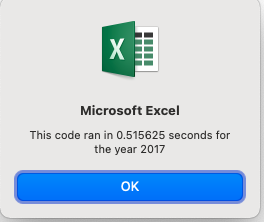
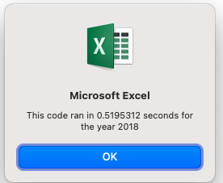
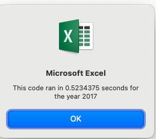

# Stock Analysis

## Overview of Analysis

Performing different analysis through the use of Excel's VBA Developer tool. We were also able to determine if refacturing of the code made the code better, or run faster.

### Purpose

The workbook contained stock data for green energy stocks in years 2017 and 2018. An individual named Steve wanted to help his parents diversify their portfolio, which was only invested in DAQO green energy stock. He was concerned about going through the process. As part of the challenge for Module 2, our job was to help analyze the stock data provided in this workbook.

The purpose of this analysis was to efficiently analyze Steve's stock data provided to us in green_stocks_xls workbook. By using the powerful tool of Excel's VBA, we were able to analyze the data automatically versus perfoming the analysis manually. The analysis was accomplished by using a series of programming readable codes. In doing so, we decreased the chance of making erros as well as saved time.

By the end of the analysis, important information was extracted by VBA such as, total volume, yearly return values, formatting the the worksheets for easier visualization, and providing tools of access within the sheet.

### Results

I found little diffrence in the outcome as a result of refacturing the code. In fact, it was challenging. I found that it was easier to make mistakes versus creating the original code. As a result, more time should be spent in original code and edit as you create, versus edting an existing code. In my case, it caused confusion. 

The difference in times were not that great. For example as shown on the following:

-Timer 2017 before refactor .515625
-Timer 2017 after refactor .5234375
-Timer 2018 before reafactor .5195312
-Timer 2018 after refactor .5117188

As a result of my analysis, the time ran faster for 2017 before the changes, and 2018 ran faster after the changes. 

### Summary

Reafactoring code, according to our module, is essentially editing the existing code to determine if it will run faster than the one that was initially provided to us. In order for it to properly work, it needs to be done in small steps. The steps are completed without major changes to existing code (e.g., external behavior, functionality).

Refacturing codes, however, can have its advantages as well as disadvantages. The following are the advantages and disadvantages that caught my attention:

###### Disadvantages

- Some parts of the code may be repeated in several parts of the code
- It may inadvertently introduced unwanted bugs
- The process may affect the testing outcomes

###### Advantages

- Errors may appear with ease
- It is mostly safe since one may not refactor without testing
- Since run times may be shorter, it can boost the system's performance
- It is possible to make it easier to read than original version

Refacturing code appears to be effective and efficient, depending on who is asked. It does have the ability to clean up the existing code and make it easier to read by others. During my challenge, however, it was not easy to maintain, edit, but was easier to comprehend.
