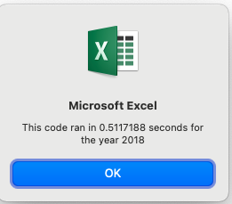
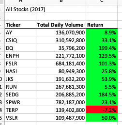
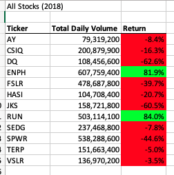

# Stock Analysis

### Overview of Analysis

Analyze stock performance data using VBA.

An Excel workbook containing stock data from years 2017 and 2018 was provided for the analysis. A client wanted to help his parents diversify their portfolio, which was only invested in DAQO green energy stock. 

The goal of the project was to analyze stock performance data using VBA. An existing code was refactored an in order to evaluate if it ran better or faster.

### Results

By the end of the analysis, important information was extracted such as total volume and yearly return values. The worksheets were formatted for easier visualization and tools for easy access within the sheet were created.

The analysis showed no significant difference in the outcome as a result of refactoring the code.

- Timer 2017 before refactor .515625
- Timer 2017 after refactor .5234375
- Timer 2018 before refactor .5195312
- Timer 2018 after refactor .5117188

As shown above, the 2017 timer ran faster **before** the changes, and 2018 timer ran faster **after** the changes. 

#### Figure 1. Timer Before Refactor 2017

#### Figure 2. Timer Before refactor 2018

#### Figure 3. Timer After Refactor 2017

#### Figure 4. Timer After Refactor 2018

#### Figure 5. Return percentages  All Stocks 2017

#### Figure 6. Return Percentages All Stocks 2018

In conclusion, ENPH and RUN were the best performing stocks in 2018 (shown in green). DQ was down 63%. 

In 2017, however, all of the stocks did extremely well, except TERP (shown in red). DQ had a massive return; close to 200%. 

### Summary

Refactoring code is essentially editing the existing code to determine if it will run faster. In order for it to properly work, it needs to be done in small steps. The steps are completed without major changes to existing code (e.g., external behavior, functionality).

Refactoring codes can have its advantages as well as disadvantages. The following are the advantages and disadvantages that caught my attention:

#### Disadvantages

- Some parts of the code may be repeated in several parts of the code
- It may inadvertently introduced unwanted bugs
- The process may affect the testing outcomes

#### Advantages

- Errors may appear with ease
- It is mostly safe since one may not refactor without testing
- Since run times may be shorter, it can boost the system's performance
- It is possible to make it easier to read than original version
